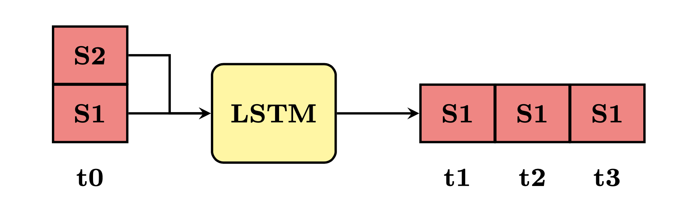

# 3 - Model training (in host)

This code loads the dataset recorded and processed in steps 1 and 2, trains a simple LSTM network on this data using Pytorch and exports the model into Tensorflow Lite. 

The LSTM is a sort of time series prediction model that receives a window of sensor data from sensor S1 and S2 and outputs the next three windows for sensor S1:

<center>

</center>

## Instructions

1. First, you need to create an environment with the necessary dependencies using pipenv: 

    ```
    pipenv install
    ```

    You will also need to manually install torch and tensorflow:

    ```
    pipenv run pip3 install torch
    ```

    ```
    pip env run pip install tensorflow
    ```

2. Copy the processed dataset files into the folder `dataset/`.
3. You can now train the model by running: 
    ```bash
    pipenv run python train.py
    ```
    The model will be exported automatically when the training finishes. 
